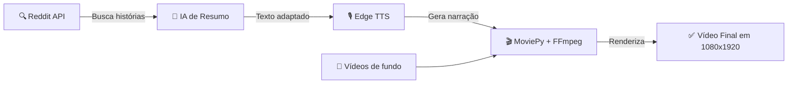

# 🤖 Reddit Shorts Bot

<div align="center">


**Automatize a criação de vídeos curtos com histórias reais do Reddit.**

*Desenvolvido por **Kassio** 🚀*

[🎬 Como Funciona](#-como-funciona) • [⚡ Instalação](#-instalação-rápida) • [🎯 Recursos](#-recursos) • [📄 Licença](#-licença)

</div>

---

## 🌟 Visão Geral

O **Reddit Shorts Bot** transforma histórias virais do Reddit em vídeos verticais prontos para **YouTube Shorts**, **TikTok** e **Instagram Reels** — tudo de forma automática.

* ✨ 100% automatizado
* 🔊 Narração natural em português via **Edge TTS**
* 🧠 IA para resumo e adaptação de texto
* 🎞️ Renderização automática em formato **vertical Full HD (1080x1920)**

---

## 🎯 Recursos

✅ Extração de histórias diretamente da **API do Reddit**
✅ Resumo e adaptação automática usando **IA (Groq / Llama)**
✅ Narração com voz natural brasileira via **Edge TTS**
✅ **Legendas sincronizadas com Whisper AI** (transcrição automática)
✅ Combinação de múltiplos vídeos de fundo (loops dinâmicos)
✅ Geração de vídeos prontos para upload em **1080x1920 vertical**

---

## 🎬 Como Funciona



### 🧩 Pipeline Resumido

1. Coleta de posts no Reddit
2. Resumo e reescrita com IA
3. Geração de narração em áudio
4. Montagem com vídeos de fundo
5. Exportação automática para `assets/output/`

> O GitHub suporta a renderização de diagramas **Mermaid** se habilitada nas configurações do repositório.

---

## ⚡ Instalação Rápida

### 🧱 Pré-requisitos

* Python **3.11+**
* Chaves de API (Reddit e Groq, se aplicável)

### 🔹 Passo 1: Clonar o repositório

```bash
git clone https://github.com/kassiods/reddit_short_bot.git
cd reddit_short_bot
```

### 🔹 Passo 2: Instalar dependências

```bash
pip install -r requirements.txt
```

### 🔹 Passo 3: Configurar variáveis de ambiente

Se existir um arquivo `.env.example`, renomeie para `.env` e preencha:

```env
# Reddit
REDDIT_CLIENT_ID=
REDDIT_SECRET=

# Groq (opcional)
GROQ_API_KEY=
```

Se não existir, crie manualmente o arquivo `.env` com as variáveis acima.

### 🔹 Passo 4: Adicionar vídeos de fundo

Coloque seus vídeos `.mp4` em `assets/videos/`
Certifique-se de que a pasta `assets/output/` exista para exportação dos resultados.

---

## 🚀 Uso

Gerar **um único vídeo**:

```bash
python main.py
```

Gerar **vários vídeos**:

```bash
python main.py 5
```

No Windows, você também pode usar o script:

```bash
gerar_videos.bat
```

Executar módulos individualmente (para testes):

```bash
python reddit_fetch.py
python summarize.py
python tts_generate.py
python video_generate.py
```

---

## 🛠️ Tecnologias Utilizadas

| Componente           | Função                                      |
| -------------------- | ------------------------------------------- |
| **PRAW**             | Coleta de histórias via API do Reddit       |
| **Groq (Llama)**     | Resumo e adaptação textual                  |
| **Edge TTS**         | Narração em voz natural (PT-BR)             |
| **Whisper AI**       | Transcrição de áudio e legendas automáticas |
| **MoviePy + FFmpeg** | Montagem e renderização de vídeo            |

---

## 📁 Estrutura do Projeto

```
reddit_short_bot/
├── main.py
├── reddit_fetch.py
├── summarize.py
├── tts_generate.py
├── video_generate.py
├── requirements.txt
├── gerar_videos.bat
└── assets/
    ├── videos/
    └── output/
```

---

## 🔧 Personalização Rápida

* 🎯 **Subreddits**: editar em `reddit_fetch.py`
* 🔊 **Voz e velocidade**: ajustar em `tts_generate.py`
* 📝 **Legendas**: ativar/desativar em `main.py` (ver `LEGENDAS.md`)
* 🎞️ **Quantidade de vídeos de fundo**: configurar em `main.py`
* 🧠 **Prompt de resumo**: customizar em `summarize.py`

---

## ❗ Solução de Problemas

| Problema                   | Solução                                      |
| -------------------------- | -------------------------------------------- |
| `ImportError (praw)`       | Execute `pip install -r requirements.txt`    |
| Variáveis não reconhecidas | Verifique o arquivo `.env`                   |
| Nenhum vídeo gerado        | Adicione arquivos `.mp4` em `assets/videos/` |

---

## 📄 Licença

Este projeto está licenciado sob a **MIT License**.
Consulte o arquivo `LICENSE` para mais detalhes.

---

## 🤝 Contribuições

Contribuições são bem-vindas!
Abra uma **issue** para discutir melhorias ou envie um **pull request** com suas alterações.
