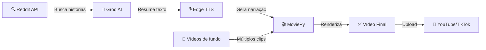

# 🤖 Reddit Shorts Bot

<div align="center">


**Sistema automático de geração de vídeos curtos profissionais a partir de histórias do Reddit**

*Criado por **Kassio** 🚀*

[🎬 Como Funciona](#-como-funciona) • [⚡ Instalação](#-instalação-rápida) • [🎯 Recursos](#-recursos) • [📖 Documentação](#-documentação)

</div>

---

## 🌟 Visão Geral

Bot inteligente que transforma histórias virais do Reddit em vídeos dinâmicos prontos para **YouTube Shorts**, **TikTok** e **Instagram Reels**. 

✨ **100% automatizado** | 🆓 **Totalmente gratuito** | 🎙️ **Voz masculina profissional** | 🎬 **Múltiplos vídeos de fundo**

---

## 🎯 Recursos

### 🤖 Inteligência Artificial
- **Groq Llama 3.3** - Resume e adapta histórias automaticamente
- **Edge TTS (Microsoft)** - Voz masculina brasileira natural e profissional
- **Geração de títulos e hashtags** - Otimizados para viralizar

### 🎬 Produção de Vídeo
- ✅ **3 vídeos de fundo diferentes** por vídeo (mais dinâmico!)
- ✅ **Formato vertical 9:16** (perfeito para Shorts/Reels/TikTok)
- ✅ **Narração 1.8x mais rápida** (mantém atenção do público)
- ✅ **Resolução Full HD** (1080x1920)
- ✅ **Duração otimizada** (30-60 segundos)

### 📖 Coleta de Conteúdo
- Busca automática em múltiplos subreddits populares
- Filtragem inteligente de histórias virais
- Suporta: `r/AmItheAsshole`, `r/tifu`, `r/relationship_advice`, `r/confessions` e mais

### 💰 Custo
**R$ 0,00** - Completamente gratuito usando APIs grátis!

---

## 🎬 Como Funciona



### Pipeline Automático

1. **📖 Coleta** - Busca histórias virais do Reddit usando PRAW
2. **🧠 Processamento** - IA resume e adapta para formato de vídeo curto
3. **🎙️ Narração** - Edge TTS gera áudio com voz masculina brasileira (1.8x velocidade)
4. **🎬 Produção** - MoviePy combina 3 vídeos de fundo diferentes + narração
5. **📝 Metadados** - Gera título e hashtags otimizados automaticamente
6. **✅ Resultado** - Vídeo vertical HD pronto para publicação!

---

## ⚡ Instalação Rápida

### Pré-requisitos

- Python 3.11+
- Conta no Reddit (grátis)
- Conta no Groq (grátis)

### Passo 1: Clone o Repositório

```bash
git clone https://github.com/seu-usuario/reddit-shorts-bot.git
cd reddit-shorts-bot
```

### Passo 2: Instale as Dependências

```bash
pip install -r requirements.txt
```

### Passo 3: Configure as APIs (5 minutos)

Renomeie `.env.example` para `.env` e configure:

```env
# Reddit API (Grátis)
REDDIT_CLIENT_ID=seu_client_id
REDDIT_SECRET=seu_secret

# Groq AI (Grátis - 14.400 requests/dia)
GROQ_API_KEY=gsk_xxxxx
```

📖 **Guia detalhado:** Leia `APIS_GRATIS.md` para obter as chaves passo a passo

### Passo 4: Adicione Vídeos de Fundo

Baixe vídeos grátis e coloque em `assets/videos/`:

- 🎮 **Gameplay**: Minecraft parkour, Subway Surfers
- 🌊 **Satisfatórios**: Slime ASMR, ondas, natureza
- 🎨 **Animações**: Loops satisfatórios

**Sites recomendados:**
- [Pexels](https://pexels.com/videos) - Maior biblioteca
- [Pixabay](https://pixabay.com/videos) - Alta qualidade  
- [Mixkit](https://mixkit.co) - Curadoria profissional

---

## 🚀 Uso

### Gerar 1 Vídeo

```bash
python main.py
```

**Output:**
```
🤖 REDDIT SHORTS BOT - INICIANDO...
📖 [1/5] Buscando história no Reddit...
✍️ [2/5] Adaptando texto para formato de vídeo...
🏷️ [3/5] Gerando título e hashtags...
🎙️ [4/5] Gerando narração com IA...
🎬 [5/5] Montando vídeo final...
🎉 VÍDEO GERADO COM SUCESSO!
```

### Gerar Múltiplos Vídeos

```bash
python main.py 5        # 5 vídeos
python main.py 10       # 10 vídeos
gerar_videos.bat        # Interface Windows
```

### Testar Módulos Individuais

```bash
python reddit_fetch.py      # Testar Reddit API
python summarize.py         # Testar IA de resumo
python tts_generate.py      # Testar voz
python video_generate.py    # Testar renderização
```

---

## 🛠️ Tecnologias Utilizadas

| Tecnologia | Função | Custo |
|------------|--------|-------|
| **PRAW** | Coleta de posts do Reddit | 🆓 Grátis |
| **Groq (Llama 3.3)** | Resumo e adaptação de texto | 🆓 Grátis |
| **Edge TTS** | Narração com voz masculina | 🆓 Grátis |
| **MoviePy** | Edição e renderização de vídeo | 🆓 Grátis |
| **FFmpeg** | Processamento de mídia | 🆓 Grátis |

**Custo total:** R$ 0,00 💰

---

## 📁 Estrutura do Projeto

```
reddit_shorts_bot/
│
├── 🎯 Core
│   ├── main.py                 # Orquestrador principal
│   ├── reddit_fetch.py         # Coleta de histórias
│   ├── summarize.py            # IA de resumo e títulos
│   ├── tts_generate.py         # Geração de narração
│   └── video_generate.py       # Renderização de vídeo
│
├── 📁 Assets
│   ├── videos/                 # Seus vídeos de fundo
│   └── output/                 # Vídeos gerados
│
├── 📋 Configuração
│   ├── .env                    # Chaves de API (privado)
│   ├── .env.example            # Template de configuração
│   └── requirements.txt        # Dependências
│
├── 📖 Documentação
│   ├── README.md               # Este arquivo
│   ├── APIS_GRATIS.md          # Guia de APIs
│   ├── TUTORIAL.md             # Tutorial completo
│   ├── QUICKSTART.md           # Início rápido
│   └── CHECKLIST.md            # Checklist de setup
│
└── 🚀 Utilitários
    └── gerar_videos.bat        # Script Windows
```

---

## ⚙️ Personalização

### 🎙️ Alterar Voz

Edite `main.py` (linha ~75):

```python
voice="adam"        # Masculina brasileira (padrão)
voice="francisca"   # Feminina brasileira
```

### ⚡ Ajustar Velocidade

```python
rate="+80%"    # 1.8x mais rápido (padrão)
rate="+50%"    # 1.5x mais rápido
rate="+100%"   # 2x mais rápido
```

### 📖 Adicionar Subreddits

Edite `reddit_fetch.py` (linha ~53):

```python
subreddits = [
    "AmItheAsshole",
    "relationship_advice",
    "tifu",
    "confessions",
    "pettyrevenge",
    "MaliciousCompliance",  # Adicione mais
]
```

### ⏱️ Duração dos Vídeos

Edite `main.py` (linha ~47):

```python
max_duration=60    # 60 segundos (padrão)
max_duration=30    # Vídeos mais curtos
max_duration=90    # Vídeos mais longos
```

### 🎬 Quantidade de Vídeos de Fundo

Edite `main.py` (linha ~82):

```python
videos_count=3    # 3 vídeos (padrão)
videos_count=5    # 5 vídeos diferentes
```

---

## � Comparação de Custos

| Componente | Este Bot | Alternativa Paga |
|------------|----------|------------------|
| **IA de Resumo** | Groq Llama 3.3 (Grátis) | OpenAI GPT-4 (~$0.002) |
| **Narração** | Edge TTS (Grátis) | ElevenLabs (~$0.30) |
| **Total/vídeo** | **R$ 0,00** 🎉 | ~R$ 1,50 |
| **100 vídeos** | **R$ 0,00** | ~R$ 150,00 |

💡 **Economia de ~R$ 150 a cada 100 vídeos!**

---

## 🎯 Estatísticas

- ⏱️ **Tempo de geração:** 2-3 minutos por vídeo
- 📏 **Duração média:** 30-60 segundos (ideal para Shorts)
- 🎬 **Vídeos/dia:** Ilimitado (API grátis)
- 💾 **Tamanho médio:** 15-30 MB por vídeo
- 🔊 **Qualidade de áudio:** 128 kbps AAC
- 📺 **Resolução:** 1080x1920 (Full HD vertical)

---

## 🚨 Solução de Problemas

### "No module named 'praw'"

```bash
pip install -r requirements.txt
```

### "REDDIT_CLIENT_ID not found"

Você esqueceu de renomear `.env.example` para `.env` e preencher as chaves.

### "Nenhum vídeo encontrado em assets/videos/"

Coloque pelo menos um vídeo MP4 na pasta `assets/videos/`.

### Erro no MoviePy/FFmpeg

No Windows, o FFmpeg é instalado automaticamente.
No Linux/Mac:

```bash
sudo apt install ffmpeg  # Ubuntu/Debian
brew install ffmpeg      # macOS
```

---

## 🔮 Melhorias Futuras

- [ ] Adicionar legendas automáticas (Whisper)
- [ ] Upload automático para YouTube
- [ ] Filtro de conteúdo inapropriado
- [ ] Interface gráfica (GUI)
- [ ] Agendamento automático (gerar vídeos todo dia às 10h)
- [ ] Suporte para múltiplos idiomas

---

## 📄 Licença

MIT License - use livremente!

---

## 🤝 Contribuições

Pull requests são bem-vindos! 

Para mudanças grandes, abra uma issue primeiro.

---

## ⚠️ Disclaimer

Este bot é para fins educacionais. Sempre dê crédito ao autor original da história do Reddit nos seus vídeos. Respeite as regras de copyright do YouTube/TikTok.

---

**Feito com ❤️ e IA**
# reddit_short_bot

